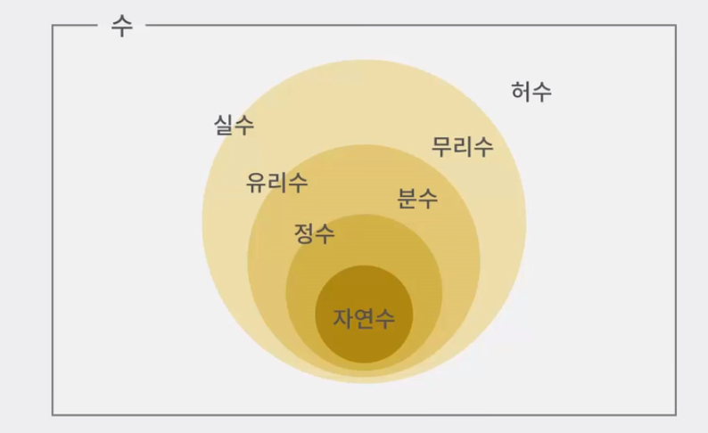

# 1. Starting Java

- 객체지향적
- 플랫폼에 독립적
- Garbage Collector로 사용되지 않는 메모리를 자동적으로 정리


# 2. Variable / Caculate

- 변수는 선언과 동시에 저장가능
- Camel case 사용
- 상수는 대문자만 사용 /  Snake case


## Defulat data type

- `double` : 8byte

### Literal

> Int / float / string / boolean


#### 1) Boolean

- true / false


#### 2) String

- `char` : 2byte


#### 3) Integer

- `byte` : -128~127 (1byte)
- `short` : -32768~32767 (2byte)
- `char` : 0~65535 (2byte)
- `int` : -2147483648 ~ 2147483647 (4byte)
- `long` : 8byte


#### 4) Float

- `float` : 4byte


> byte < short, char < int < long < float < double




### 형변환

#### 1. 묵시적 형변환

> 크기가 작은 타입을 큰타입으로
>
> ```java
> int x = 5000;
> long y = x
> ```


#### 2. 명시적 형변환

> 크기가 큰 타입을 작은 타입으로
>
> ```java
> long x = 50000;
> //int y = x; 안됨
> int y= (int)x;
> ```

