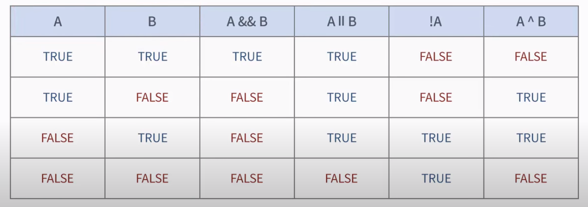

# 제어

## 1. 조건

```
if (조건) {
	코드
} else if (조건) {
	코드
} else {
	코드
}
```


## 2. 논리 연산자




 ### 삼항 연산자

> `(조건) ? 참 : 거짓`


### switch

> 조건문과 다르게 case에 부합하다면 모두 실행한다. 그래서 break를 잘 사용해 주어야 함.

```java
switch (var) {
    case 조건 :
      	blabla
    case 조건2 :
        blabla
    default :
        blabla
    	break
}
```


## 3. 반복문

### while

```java
while (조건) {
    blabla
}
```


### do while

> 한번은 무조건 실행하는 코드

```java
do {
	blabla
} while (조건)
```


### for

```java
for (변수;조건;실행 구문) {
    blabla
}
```

